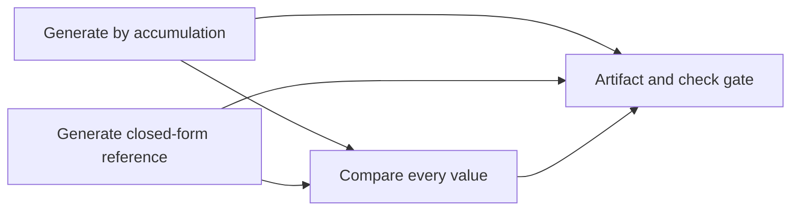

# AgentLedger

**Turn local engineering work into an inspectable graph of checks, artifacts and review decisions.**

AgentLedger is an original TypeScript/Node.js tool by nazeeh111. It schedules explicitly declared local commands, records their outcomes, verifies artifact hashes and produces an offline report. An optional Codex CLI task adds a structured **model opinion** alongside automated evidence. A model saying “approved” never turns a failing command into a passing check.

No API key, paid service, global plugin or live model call is needed for the offline example. Node.js 24+ and macOS/Linux are required for execution; process groups provide timeout/cancellation handling.

## Run the complete offline example

```sh
npm ci
npm run check
npm test
npm run plan          # validates and prints commands; executes nothing
npm run demo          # explicitly executes the four-task example
```

Open `demo-report/index.html` directly. The report has no external scripts, fonts, network requests or dependencies. `demo-report/report.json` contains machine-readable results. The example independently generates 101 triangular numbers by accumulation and a closed-form expression, compares every value, then verifies the resulting artifacts at the review gate.



[View the offline example report](https://nazeeh111.github.io/AgentLedger/), [inspect the generated offline JSON evidence](docs/demo/report.json) or download and open the [self-contained example report](docs/demo/index.html). These artifacts came from the actual four-task local run, with no model call.

## Why this exists

Task logs alone do not tell you whether a required file exists, whether it changed after a check, or whether an agent's assessment rests on a passing test. AgentLedger keeps those questions separate:

- **Command evidence:** argument array, expected and actual exit result, attempts, duration and dependency status.
- **Artifact evidence:** bounded regular files, SHA-256 hashes and optional expected hashes.
- **Review gate:** named successful command checks plus freshly rehashed artifact references.
- **Model opinion:** optional `approve`, `changes` or `inconclusive`, with a rationale. Opinion is not correctness proof or an independent human review.

## Workflow contract

A version-1 JSON workflow declares `name`, `concurrency` (1–8) and `tasks` (1–64). See [the executable example](examples/offline.json) and [design](DESIGN.md).

```json
{
  "version": 1,
  "name": "Local checks",
  "concurrency": 2,
  "tasks": [
    {
      "id": "test",
      "command": ["node", "--test", "tests/runner.test.ts"],
      "inputs": ["tests/runner.test.ts"],
      "timeoutMs": 30000
    }
  ]
}
```

Task IDs are unique. `deps` are explicit IDs; cycles, missing dependencies and unknown fields are rejected. Each task has exactly one `command`, `codex`, or `review`. Commands are argument arrays with **no implicit shell**. You can deliberately name a shell as the executable, so this is not a sandbox or an untrusted-code service. Read and trust imported commands before execution.

`cwd` defaults to `.`. Inputs and artifact paths are always relative to the selected root, **not** to task `cwd`. Absolute paths, traversal and symlinks are rejected. Each artifact has one declared producer. Consuming another task's artifact as an input requires that producer upstream. `artifacts` accepts `{ "path": "build/result.json", "sha256": "optional 64 lowercase hex characters" }`.

`expectedExit` defaults to 0. `timeoutMs` is 50–300,000; `retries` is 0–2, default 0. Combined declared timeout/retry budget cannot exceed one hour. Timeout and cancellation terminate POSIX process groups; downstream tasks are skipped after failure. Trusted tasks must not deliberately escape their group, daemonize, or mutate undeclared outputs.

## Plan, execute and resume

```sh
node src/cli.ts workflow.json --root /path/to/project --out report-run
node src/cli.ts workflow.json --root /path/to/project --out report-run --execute
node src/cli.ts workflow.json --root /path/to/project --out report-run --execute --resume
```

Default mode validates and prints the plan without creating a report directory or running commands. `--execute` is explicit authorization for those trusted commands. The report directory must be a **new confined directory with an existing parent**. `--resume` only accepts an existing AgentLedger directory and does not remove unrelated files. Reports are replaced atomically inside that managed directory; command outputs are controlled by the commands themselves.

Resume reuses successful **command tasks** only when task specification, canonical execution root and working directory, declared input hashes, dependency fingerprints, artifact hashes, runner implementation hash and Node version match. Changed inputs/specifications or missing/tampered artifacts cause reruns; downstream fingerprints invalidate as appropriate. Declared inputs are rechecked before each attempt and after execution; a detected mutation fails the task rather than producing reusable evidence. This is a before/after check, not a filesystem snapshot: concurrent edits restored between checks can escape detection, so keep inputs stable during a run. Review gates always rerun. Codex opinions always rerun with fresh output paths and still require opt-in. External services, undeclared files and changes in non-Node executables/environment are not automatically fingerprinted: declare every relevant input or use a new report directory for a fresh run.

## Optional Codex adapter

```sh
node src/cli.ts examples/codex-review.json --out codex-report
node src/cli.ts examples/codex-review.json --out codex-report --execute --allow-codex
```

This uses the installed `codex` CLI and existing sign-in. It does not read credential stores, install hooks, select a model, purchase credits or configure an API key. It invokes `codex exec --json --output-schema … -s read-only -C … --output-last-message … -`, supplying the prompt through stdin. Native sandbox and approval protections stay enabled. A Git repository and working local Codex setup are normally required. The user-selected default model is retained. Model work consumes the user's existing usage allowance and is never part of the default offline demo.

The adapter has automated fake-CLI checks plus one live integration run on September 23, 2026: all five example tasks passed using the installed Codex CLI, its native read-only sandbox and the user-configured model. The model opinion returned in about 27 seconds, separately from the three successful command checks and artifact gate. This verifies that example integration, not every model or CLI configuration. Consult [Codex non-interactive documentation](https://learn.chatgpt.com/docs/non-interactive-mode) for CLI behavior; [`examples/codex-review.json`](examples/codex-review.json) is a runnable opt-in template, not a precomputed model result.

## Privacy and limits

Do not put credentials in manifests, arguments, prompts, filenames or task output. Reports record exact command arguments, paths and artifact hashes. Child stdout/stderr is **omitted by default**; `--include-output` explicitly includes up to 64 KiB and marks truncation. Opting out on resume removes previously captured output from the new report. Structured model opinions are included and may contain workspace details. The CLI inherits only a small environment allowlist needed for command discovery, home/temp paths, locale and existing Codex configuration; arbitrary task code can still read whatever the OS permits.

Manifests are capped at 1 MiB and depth 32, input/artifact files at 32 MiB each, and output capture is bounded. Files are streamed for hashing. These checks reduce accidental workloads; they do not provide CPU/memory isolation for arbitrary commands or defend against a hostile local administrator. Reports are unsigned local evidence and can be edited. A passed task proves only its declared exit criterion and artifact checks, not general correctness, security, benchmark performance or human approval.

See [SECURITY.md](SECURITY.md). No “self-improvement,” hundreds-of-agents throughput, or fully autonomous correctness claims are made.

## Development and exits

```sh
npm run format:check
npm run check
npm test
npm run build
node dist/cli.js --help
```

Exit 0: plan validated or run passed. Exit 1: completed run has failed/skipped/timed-out tasks. Exit 2: configuration/setup/report error. Exit 130: cancelled run with report saved where possible. Synthetic automated tests exercise real subprocesses with a fake model CLI. The separate opt-in live integration check used the existing local Codex sign-in; no credentials were read or included in reports.

**Publication note:** Built locally using Git before publication. Upload timestamps record publication of this version, not invented development dates.

Original software © 2026 nazeeh111, [MIT](LICENSE). Codex is an optional external tool; AgentLedger is not affiliated with OpenAI.
